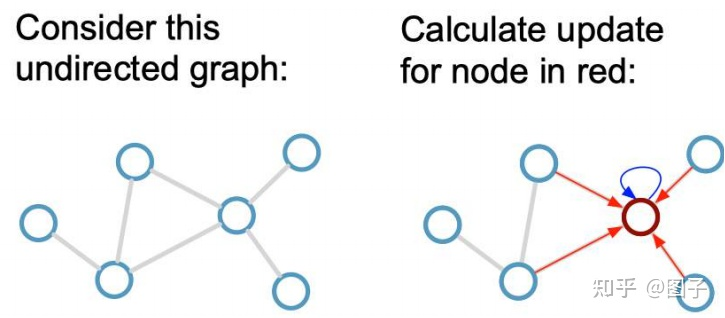

## 消息传播神经网络（MPNN）

GNN是一个邻居聚合策略，一个节点的表示向量，由它的邻居节点通过循环的聚合和转移表示向量计算得来。我们来想象人类学习知识的过程，在自身具有一定知识的基础上，我们会想要从周围的伙伴那里学习到更多的知识，然后将伙伴给予的信息与自身已有的知识组合起来，更新并获得更高阶的知识，这个过程就是一个消息传递过程。

以下图为例，假设我们要计算 ![[公式]](https://www.zhihu.com/equation?tex=k) 时刻红色节点的表示，从消息传递的角度来看，会经历以下步骤：1）**首先从邻居获取信息：**计算红色节点周围的四个邻居节点的消息总和。2）**对获得的信息加以利用**：将获得的消息与 ![[公式]](https://www.zhihu.com/equation?tex=%EF%BC%88k-1%29) 时刻红色节点本身的表示组合起来，计算得到 ![[公式]](https://www.zhihu.com/equation?tex=k)时刻的红色节点表示。

在理解了消息传递过程之后，我们正式介绍形式化的消息传递过程。MPNN共包含两个阶段：消息传递阶段和读出阶段（readout phase）。

1. ***消息传递阶段*** ：共运行T个时间步，并包含以下两个子函数：

- **Aggregation Function**：也称消息函数，作用是聚合邻居节点的特征，形成一个消息向量，准备传递给中心节点。
- **Combination Function**：也称节点更新函数，作用是更新当前时刻的节点表示，组合当前时刻节点的表示以及从Aggregation Function中获得的消息。

2. ***读出阶段：***针对于图级别的任务（如图分类）仅仅获得节点级别的表示是不够的，需要通过读出函数（Readout Function）聚合节点级别的表示，计算获得图级别的表示。

因此，不同种类的GNN就是通过设计不同的Aggregation Function，Combination Function以及Readout Function实现的。也就是说，从邻居聚合的信息不同，邻居信息与自身信息的组合方式不同，或者节点的读出方式不同，最终都会导致我们最终获得的表示向量不同。**不同的任务为了获得更准确的预测效果，会着重于抓取不同的信息**，本文下面会对比不同论文中以上三个函数的设计模式，进而理解和区分不同的GNN网络结构。

## 消息传递范式

在上面的等式中， 𝜙是定义在每条边上的消息函数，它通过将边上特征与其两端节点的特征相结合来生成消息。 **聚合函数** 𝜌 会聚合节点接受到的消息。 **更新函数** 𝜓 会结合聚合后的消息和节点本身的特征来更新节点的特征。

## 参考

https://zhuanlan.zhihu.com/p/352510643