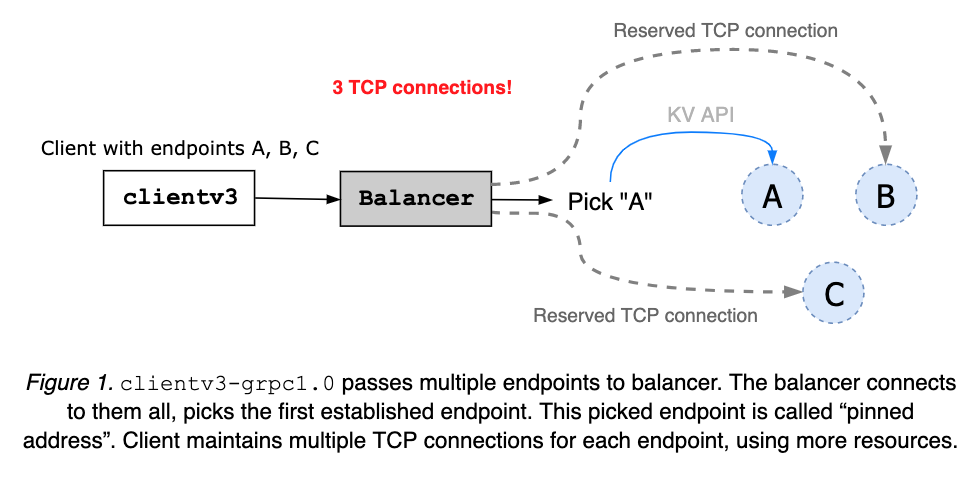
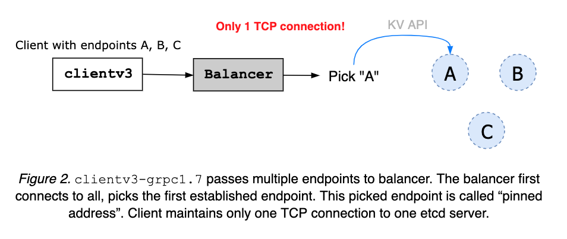
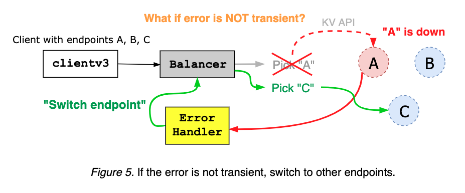
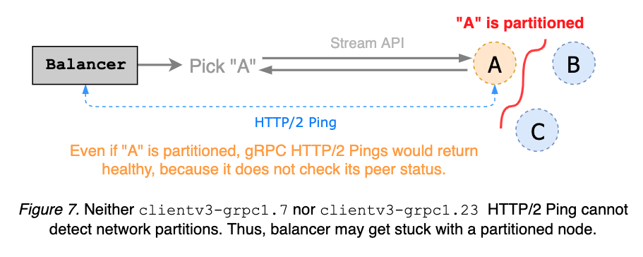

## Introduction

etcd server has proven its robustness with years of failure injection testing. Most complex application logic is already handled by etcd server and its data stores (e.g. cluster membership is transparent to clients, with Raft-layer forwarding proposals to leader). Although server components are correct, its composition with client requires a different set of intricate（错综复杂的）protocols to guarantee its correctness and high availability under faulty conditions. Ideally, etcd server provides one logical cluster view of many physical machines, and client implements automatic failover between replicas（客户端在副本之间实现自动故障切换）. This documents client architectural decisions and its implementation details.

## Client Requirements

*Correctness*. Requests may fail in the presence of server faults. However, it never violates consistency guarantees: global ordering properties, never write corrupted data, at-most once semantics for mutable operations, watch never observes partial events（从不观察局部事件）, and so on.

*Liveness*. Servers may fail or disconnect briefly. Clients should make progress in either way. Clients should [never deadlock](https://github.com/etcd-io/etcd/issues/8980) waiting for a server to come back from offline, unless configured to do so. Ideally, clients detect unavailable servers with HTTP/2 ping and failover to other nodes with clear error messages.

*Effectiveness*. Clients should operate effectively with minimum resources: previous TCP connections should be [gracefully closed](https://github.com/etcd-io/etcd/issues/9212) after endpoint switch. Failover mechanism should effectively predict the next replica to connect, without wastefully retrying on failed nodes.

*Portability*. Official client should be clearly documented and its implementation be applicable to other language bindings. Error handling between different language bindings should be consistent. Since etcd is fully committed to gRPC, implementation should be closely aligned with gRPC long-term design goals (e.g. pluggable retry policy should be compatible with [gRPC retry](https://github.com/grpc/proposal/blob/master/A6-client-retries.md)). Upgrades between two client versions should be non-disruptive.

## Client Overview

etcd client implements the following components:

- balancer that establishes gRPC connections to an etcd cluster,
- API client that sends RPCs to an etcd server, and
- error handler that decides whether to retry a failed request or switch endpoints.

Languages may differ in how to establish an initial connection (e.g. configure TLS), how to encode and send Protocol Buffer messages to server, how to handle stream RPCs, and so on. However, errors returned from etcd server will be the same. So should be error handling and retry policy.

### clientv3-grpc1.0: Balancer Overview

`clientv3-grpc1.0` maintains multiple TCP connections when configured with multiple etcd endpoints. Then pick one address and use it to send all client requests. The pinned address is maintained until the client object is closed (see *Figure 1*). When the client receives an error, it randomly picks another and retries.

### clientv3-grpc1.0: Balancer Limitation

`clientv3-grpc1.0` opening multiple TCP connections may provide faster balancer failover but requires more resources. The balancer does not understand node’s health status or cluster membership. So, it is possible that balancer gets stuck with one failed or partitioned node.

### clientv3-grpc1.7: Balancer Overview

`clientv3-grpc1.7` maintains only one TCP connection to a chosen etcd server. When given multiple cluster endpoints, a client first tries to connect to them all. As soon as one connection is up, balancer pins（固定） the address, closing others (see *Figure 2*). The pinned address is to be maintained until the client object is closed. An error, from server or client network fault, is sent to client error handler (see *Figure 3*).

The client error handler takes an error from gRPC server, and decides whether to retry on the same endpoint, or to switch to other addresses, based on the error code and message (see *Figure 4* and *Figure 5*).

Stream RPCs, such as Watch and KeepAlive, are often requested with no timeouts. Instead, client can send periodic HTTP/2 pings to check the status of a pinned endpoint; if the server does not respond to the ping, balancer switches to other endpoints (see *Figure 6*).

### clientv3-grpc1.7: Balancer Limitation

`clientv3-grpc1.7` balancer sends HTTP/2 keepalives to detect disconnects from streaming requests. It is a simple gRPC server ping mechanism and does not reason about cluster membership, thus unable to detect network partitions. Since partitioned gRPC server can still respond to client pings, balancer may get stuck with a partitioned node. Ideally, keepalive ping detects partition and triggers endpoint switch, before request time-out (see [etcd#8673](https://github.com/etcd-io/etcd/issues/8673) and *Figure 7*).

`clientv3-grpc1.7` balancer maintains a list of unhealthy endpoints. Disconnected addresses are added to “unhealthy” list, and considered unavailable until after wait duration, which is hard coded as dial timeout with default value 5-second. Balancer can have false positives on which endpoints are unhealthy. For instance, endpoint A may come back right after being blacklisted, but still unusable for next 5 seconds (see *Figure 8*).

`clientv3-grpc1.0` suffered the same problems above.

